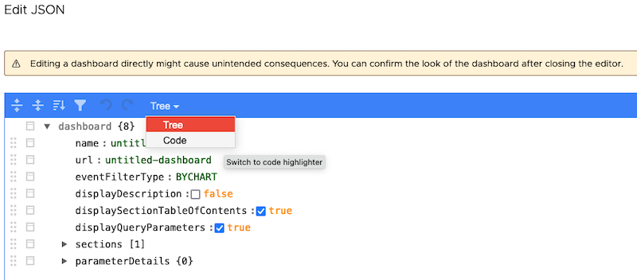
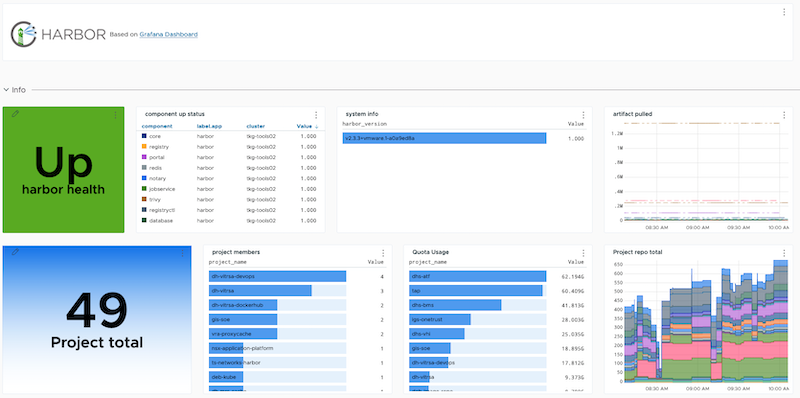
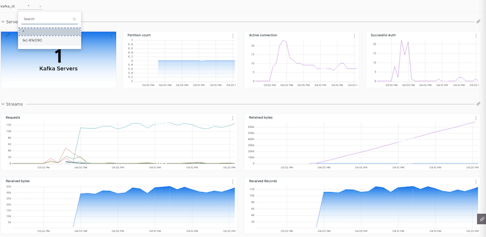
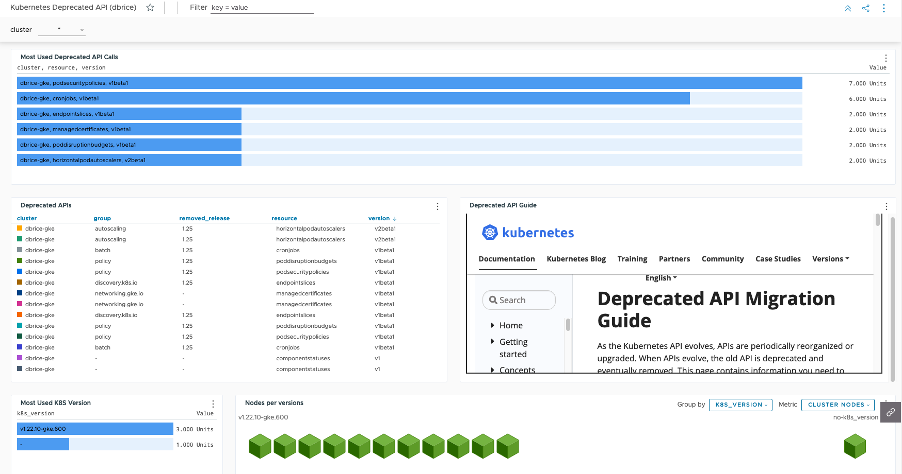

# wavefront-dashboards

Collection of dashboards in JSON format for [Aria Operations for Application](https://www.vmware.com/products/aria-operations-for-applications.html) (formerly Tanzu Observability by Wavefront)

## Getting started

* Terraform is the recommanded installation.
* [Generate an API Token](https://docs.wavefront.com/users_account_managing.html#generate-an-api-token)

### Terraform

Define cluster address and API Token as env variables

```sh
$ export TF_VAR_WAVEFRONT_ADDRESS="cluster.wavefront.com"
$ export TF_VAR_WAVEFRONT_TOKEN="your-wf-token-secret"
```

Review plan and apply changes

```sh
$ terraform init
$ terraform plan
$ terraform apply
```

### Manual Installation

Create a new dashboard and import JSON Code



## Dashboards

### Harbor
Based on [Grafana Dashboard](https://github.com/goharbor/harbor/tree/main/contrib/grafana-dashborad)

Works with: 
 - Harbor Community Helm Chart
 - Tanzu Package



### Confluent Cloud (kafka)
Based on [Prometheus Exporter for Confluent Cloud](https://www.confluent.io/fr-fr/blog/bring-your-own-monitoring-with-confluent-cloud/#prometheus)

> metrics prefix need to be `prometheus`or to be change in JSON




### Kubernetes Deprecated API
Based on [K8S Blog about deprecation](https://kubernetes.io/blog/2020/09/03/warnings/#metrics)

Requirements: collect apiServer Metrics `collector.apiServerMetrics=true`


